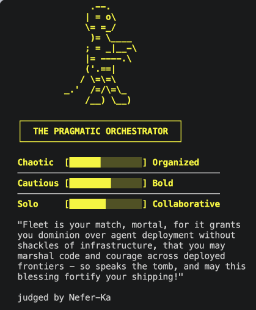

[For translation, open lesson in new tab and use Chrome translate](https://langchain-ai.github.io/lca-lessons/deepagents/m1/m1.9-practice.html)

<style>@import url('../shared/sd-components.css');</style>
<script src="../shared/sd-components.js"></script>

<div class="page-lang-switch" data-page-lang-switch>
  <button class="page-lang-btn" data-page-lang="python" aria-selected="false">Python</button>
  <button class="page-lang-btn" data-page-lang="typescript" aria-selected="false">TypeScript</button>
</div>

# Test Your Skills: Build a Judge Persona

<div style="text-align:center;margin:4rem 0 2.5rem;">
  <p style="font-size:0.8rem;color:#40668D;font-family:'IBM Plex Mono',monospace;letter-spacing:0.07em;text-transform:uppercase;margin-bottom:0.75rem;">&#8595; click to celebrate &#8595;</p>
  <button id="get-started-btn" onclick="launchConfetti()" style="
    background: #fff;
    color: #000;
    border: 2px solid #000;
    border-radius: 12px;
    padding: 18px 48px;
    font-size: 1.3rem;
    font-weight: 700;
    font-family: 'IBM Plex Mono', monospace;
    cursor: pointer;
    letter-spacing: 0.04em;
    white-space: nowrap;
    box-sizing: border-box;
    box-shadow: 0 4px 18px rgba(0,0,0,0.15);
    transition: transform 0.15s, box-shadow 0.15s;
  "
  onmouseover="this.style.transform='scale(1.07)';this.style.boxShadow='0 6px 28px rgba(0,0,0,0.3)'"
  onmouseout="this.style.transform='scale(1)';this.style.boxShadow='0 4px 18px rgba(0,0,0,0.15)'"
  > Congratulations on finishing Module 1!</button>
</div>

<canvas id="confetti-canvas" style="position:fixed;top:0;left:0;width:100%;height:100%;pointer-events:none;z-index:9999;display:none;"></canvas>

<p style="font-size:0.8rem;color:#40668D;font-family:'IBM Plex Mono',monospace;letter-spacing:0.07em;text-transform:uppercase;margin:0 0 0.75rem;">You've now covered</p>

<div style="display:grid;grid-template-columns:repeat(2,1fr);gap:10px;margin-bottom:1.75rem;">
  <div style="display:flex;align-items:center;gap:10px;background:#F2FAFF;border:1px solid #CCE9FF;border-radius:10px;padding:10px 14px;font-size:0.92rem;color:#030710;"><span style="color:#006DDD;font-weight:700;">✓</span>Running a deep agent</div>
  <div style="display:flex;align-items:center;gap:10px;background:#F2FAFF;border:1px solid #CCE9FF;border-radius:10px;padding:10px 14px;font-size:0.92rem;color:#030710;"><span style="color:#006DDD;font-weight:700;">✓</span>Choosing models</div>
  <div style="display:flex;align-items:center;gap:10px;background:#F2FAFF;border:1px solid #CCE9FF;border-radius:10px;padding:10px 14px;font-size:0.92rem;color:#030710;"><span style="color:#006DDD;font-weight:700;">✓</span>Writing system prompts</div>
  <div style="display:flex;align-items:center;gap:10px;background:#F2FAFF;border:1px solid #CCE9FF;border-radius:10px;padding:10px 14px;font-size:0.92rem;color:#030710;"><span style="color:#006DDD;font-weight:700;">✓</span>Optimizing with prompt caching</div>
  <div style="display:flex;align-items:center;gap:10px;background:#F2FAFF;border:1px solid #CCE9FF;border-radius:10px;padding:10px 14px;font-size:0.92rem;color:#030710;"><span style="color:#006DDD;font-weight:700;">✓</span>Building custom tools</div>
  <div style="display:flex;align-items:center;gap:10px;background:#F2FAFF;border:1px solid #CCE9FF;border-radius:10px;padding:10px 14px;font-size:0.92rem;color:#030710;"><span style="color:#006DDD;font-weight:700;">✓</span>Connecting MCP servers</div>
  <div style="display:flex;align-items:center;gap:10px;background:#F2FAFF;border:1px solid #CCE9FF;border-radius:10px;padding:10px 14px;font-size:0.92rem;color:#030710;"><span style="color:#006DDD;font-weight:700;">✓</span>Messages, threads, checkpointers</div>
  <div style="display:flex;align-items:center;gap:10px;background:#F2FAFF;border:1px solid #CCE9FF;border-radius:10px;padding:10px 14px;font-size:0.92rem;color:#030710;"><span style="color:#006DDD;font-weight:700;">✓</span>Human-in-the-loop approval</div>
</div>

<div style="text-align:center;font-size:1.5rem;color:#34D399;margin:0.25rem 0 1rem;">↓</div>

<div style="background:#E3F9F0;border:1.5px solid #34D399;border-radius:12px;padding:1rem 1.25rem;color:#0B4A34;">
  <p style="margin:0 0 0.5rem;font-weight:700;font-size:1rem;color:#0B4A34;">Fun Personality Quiz!</p>
  <p style="margin:0;">In this practice, everything you just learned comes together into a fun personality quiz that figures out what kind of developer/builder you are, then matches you to a real LangChain product based on that style.</p>
</div>

<script>
(function () {
  var canvas, ctx, particles = [], running = false, animId;

  var COLORS = [
    '#006DDD','#3399FF','#7FC8FF','#CCE9FF',
    '#0E9F6E','#34D399','#99F6E4',
    '#FFE9A8','#FF8FA3','#ffffff'
  ];

  function Confetti(x, y) {
    this.x = x; this.y = y;
    this.vx = (Math.random() - 0.5) * 7;
    this.vy = -(9 + Math.random() * 10);
    this.gravity = 0.32 + Math.random() * 0.16;
    this.rotation = Math.random() * Math.PI * 2;
    this.rotationSpeed = (Math.random() - 0.5) * 0.3;
    this.width = 5 + Math.random() * 5;
    this.height = 3 + Math.random() * 4;
    this.color = COLORS[Math.floor(Math.random() * COLORS.length)];
    this.life = 0;
    this.maxLife = 90 + Math.floor(Math.random() * 45);
  }

  Confetti.prototype.update = function () {
    this.vy += this.gravity;
    this.x += this.vx;
    this.y += this.vy;
    this.rotation += this.rotationSpeed;
    this.life++;
  };

  Confetti.prototype.alpha = function () {
    var fadeStart = this.maxLife * 0.7;
    if (this.life < fadeStart) return 1;
    return Math.max(0, 1 - (this.life - fadeStart) / (this.maxLife - fadeStart));
  };

  Confetti.prototype.dead = function () {
    return this.life >= this.maxLife || this.y > (canvas ? canvas.height + 40 : 1e9);
  };

  Confetti.prototype.draw = function (ctx) {
    var a = this.alpha();
    if (a <= 0) return;
    ctx.save();
    ctx.globalAlpha = a;
    ctx.translate(this.x, this.y);
    ctx.rotate(this.rotation);
    ctx.fillStyle = this.color;
    ctx.fillRect(-this.width / 2, -this.height / 2, this.width, this.height);
    ctx.restore();
  };

  function spawnConfetti() {
    var x = Math.random() * window.innerWidth;
    var y = window.innerHeight + 10;
    particles.push(new Confetti(x, y));
  }

  function loop() {
    ctx.clearRect(0, 0, canvas.width, canvas.height);
    particles = particles.filter(function (p) { return !p.dead(); });
    particles.forEach(function (p) { p.update(); p.draw(ctx); });
    if (running || particles.length > 0) animId = requestAnimationFrame(loop);
    else { canvas.style.display = 'none'; }
  }

  window.launchConfetti = function () {
    if (!canvas) {
      canvas = document.getElementById('confetti-canvas');
      ctx = canvas.getContext('2d');
    }
    canvas.width = window.innerWidth;
    canvas.height = window.innerHeight;
    canvas.style.display = 'block';

    var btn = document.getElementById('get-started-btn');
    if (!btn.style.width) btn.style.width = btn.offsetWidth + 'px';
    btn.textContent = 'Again!';

    particles = [];
    running = true;

    var shots = 0, maxShots = 16;
    function fire() {
      if (shots >= maxShots) { running = false; return; }
      var count = 10 + Math.floor(Math.random() * 10);
      for (var i = 0; i < count; i++) spawnConfetti();
      shots++;
      setTimeout(fire, 90 + Math.random() * 180);
    }

    if (animId) cancelAnimationFrame(animId);
    fire();
    loop();
  };
})();
</script>

---

<div data-lang="python" markdown="1">

## What you'll build

Open `python/m1/Practice/judge_card_practice.py`. Running it end to end:

1. Runs the quiz.
2. Hands your answers to an agent running your persona.
3. The agent tallies your traits and matches you to a real LangChain product.
4. You approve, edit, or reject the post before it's "posted" on X. This is a mock post, nothing actually leaves your terminal, so screenshot your real card and post it on X or LinkedIn with @LangChain tagged, we would love to see what you build!
5. Your approved card renders as ASCII art in your terminal and saves to `output/`.

## What's provided

The mechanical parts live in `judge_card_helpers.py`, same idea as `models.py`: shared setup you import, not code you need to read to do this practice exercise.

- `run_quiz()`: the 8-question arrow-key quiz.
- `PRODUCT_MATCHES`: the trait -> real LangChain product lookup.
- `render_card()`: renders and saves your finished card as ASCII art.
- `post_card()`: the "publish" tool. Renders a mock post on our fake X platform; nothing ever leaves your terminal.
- `run_judge()`: the invoke/interrupt-resume loop. You already wrote this once in the HITL lesson, no need to write it again.
- `TOOL_SEQUENCE`: the tool-calling steps every persona shares.

## What you fill in

Six TODOs, each a small, direct change tied to a Module 1 lesson, not a spec to implement from scratch.

<table>
<thead>
<tr><th>TODO</th><th>Lesson</th><th>What you do</th></tr>
</thead>
<tbody>
<tr><td>1</td><td>1.4, The System Prompt: Persona</td><td>Write your own judge persona, a name and a voice. This is the card that gets posted.</td></tr>
<tr><td>2</td><td>1.5, Tools: Custom Tools</td><td>Finish <code>score_and_match()</code>: turn the tallied trait scores into a matched product.</td></tr>
<tr><td>3</td><td>1.6, MCP (stretch goal)</td><td>Ground the verdict in one real MCP fact about your matched product instead of a placeholder.</td></tr>
<tr><td>4</td><td>1.7, Messages, Threads, and Checkpointers</td><td>Add a second persona so it runs in its own thread; compare both cards side by side.</td></tr>
<tr><td>5</td><td>1.8, Human-in-the-Loop: Decision Types</td><td>Set <code>interrupt_on</code> so posting the card requires your approval first.</td></tr>
<tr><td>6</td><td>1.3, Models (optional)</td><td>Swap in <code>strong_model</code> and compare comedic timing.</td></tr>
</tbody>
</table>

## Run it

```bash
cd python
uv run python m1/Practice/judge_card_practice.py
```

Stuck, or want to see the finished shape before you start? `judge_card_practice_filled.py` is a reference copy with every TODO filled in; run it the same way to see what "done" looks like end to end.

Try to avoid peeking unless you're really stuck, you'll get more out of this by working through the TODOs yourself first.

</div>

<div data-lang="typescript" markdown="1">

## What you'll build

Open `typescript/m1/Practice/judge_card_practice.ts`. Running it end to end:

1. Runs the quiz.
2. Hands your answers to an agent running your persona.
3. The agent tallies your traits and matches you to a real LangChain product.
4. You approve, edit, or reject the post before it's "posted" on X. This is a mock post, nothing actually leaves your terminal, so screenshot your real card and post it on X or LinkedIn with @LangChain tagged, we would love to see what you build!
5. Your approved card renders as ASCII art in your terminal and saves to `output/`.

## What's provided

The mechanical parts live in `judge_card_helpers.ts`, same idea as `models.ts`: shared setup you import, not code you need to read to do this practice exercise.

- `runQuiz()`: the 8-question arrow-key quiz.
- `PRODUCT_MATCHES`: the trait -> real LangChain product lookup.
- `renderCard`: renders and saves your finished card as ASCII art.
- `postCard`: the "publish" tool. Renders a mock post on our fake X platform; nothing ever leaves your terminal.
- `runJudge()`: the invoke/interrupt-resume loop. You already wrote this once in the HITL lesson, no need to write it again.
- `TOOL_SEQUENCE`: the tool-calling steps every persona shares.

## What you fill in

Six TODOs, each a small, direct change tied to a Module 1 lesson, not a spec to implement from scratch.

<table>
<thead>
<tr><th>TODO</th><th>Lesson</th><th>What you do</th></tr>
</thead>
<tbody>
<tr><td>1</td><td>1.4, The System Prompt: Persona</td><td>Write your own judge persona, a name and a voice. This is the card that gets posted.</td></tr>
<tr><td>2</td><td>1.5, Tools: Custom Tools</td><td>Finish <code>scoreAndMatch()</code>: turn the tallied trait scores into a matched product.</td></tr>
<tr><td>3</td><td>1.6, MCP (stretch goal)</td><td>Ground the verdict in one real MCP fact about your matched product instead of a placeholder.</td></tr>
<tr><td>4</td><td>1.7, Messages, Threads, and Checkpointers</td><td>Add a second persona so it runs in its own thread; compare both cards side by side.</td></tr>
<tr><td>5</td><td>1.8, Human-in-the-Loop: Decision Types</td><td>Set <code>interruptOn</code> so posting the card requires your approval first.</td></tr>
<tr><td>6</td><td>1.3, Models (optional)</td><td>Swap in <code>strongModel</code> and compare comedic timing.</td></tr>
</tbody>
</table>

## Run it

```bash
cd typescript
pnpm tsx ./m1/Practice/judge_card_practice.ts
```

Stuck, or want to see the finished shape before you start? `judge_card_practice_filled.ts` is a reference copy with every TODO filled in; run it the same way to see what "done" looks like end to end.

Try to avoid peeking unless you're really stuck, you'll get more out of this by working through the TODOs yourself first.

</div>

<details style="width:50%;background:#fff;border:1.5px solid #000;">
<summary style="color:#000;border-bottom:none;">Sneak Peek [click to expand]</summary>



</details>

## Share it

<div style="background:#CCE9FF;border:1.5px solid #7FC8FF;border-radius:12px;padding:1rem 1.25rem;color:#030710;">Got a card you like? Screenshot it, tag @LangChain on X or LinkedIn, and show us what your judge came up with. We want to see what you build!</div>

