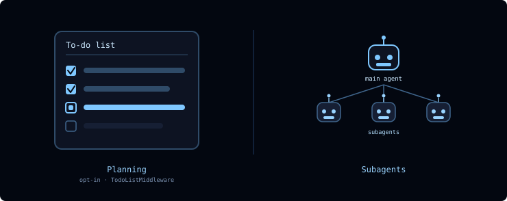
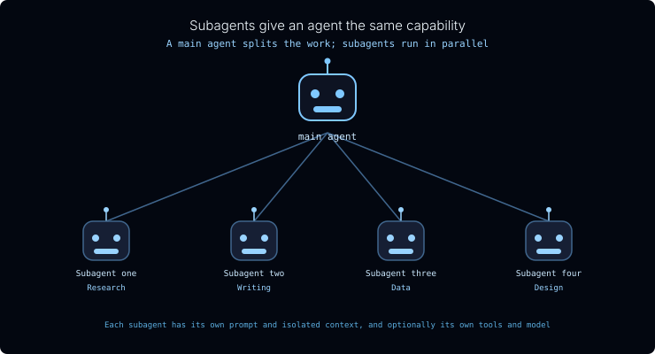
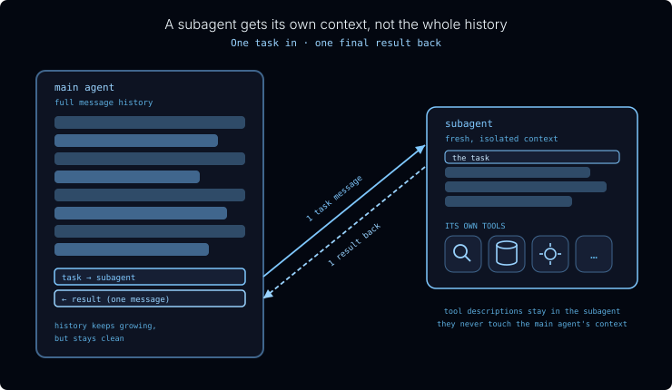
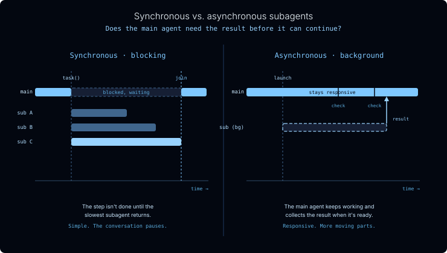

[For translation, open lesson in new tab and use Chrome translate](https://langchain-ai.github.io/lca-lessons/deepagents/m4/m4.1-delegation.html)

<style>@import url('../shared/sd-components.css');</style>
<script src="../shared/sd-components.js"></script>

# Delegation

<style>
.lt-bar {
  display: flex;
  flex-wrap: wrap;
  gap: 20px;
  margin: 28px 0 0;
  border-bottom: 2px solid #CCE9FF;
}
.lt-group { display: flex; gap: 3px; }
.lt-quiz  { --c: #7C3AED; }
.lt-del   { --c: #CA8A04; }
.lt-tab {
  font: 500 14px 'IBM Plex Mono', monospace;
  padding: 9px 14px;
  border: none;
  background: transparent;
  color: #40668D;
  cursor: pointer;
  border-bottom: 3px solid transparent;
  margin-bottom: -2px;
  border-radius: 6px 6px 0 0;
  transition: background .15s, color .15s, border-color .15s;
  white-space: nowrap;
}
.lt-tab:hover { background: #F2FAFF; color: #030710; }
.lt-tab.active {
  color: var(--c);
  border-bottom-color: var(--c);
  background: #fff;
}
.lt-panel { display: none; padding-top: 24px; }
.lt-panel.active { display: block; }
@media (max-width: 600px) {
  .lt-bar { flex-wrap: nowrap; overflow-x: auto; gap: 12px; }
  .lt-tab { padding: 8px 10px; font-size: 13px; }
}
</style>

<div class="lt-bar" role="tablist" aria-label="Lesson sections">
  <div class="lt-group lt-del">
    <button class="lt-tab active" data-p="del" role="tab" aria-selected="true">Delegation</button>
  </div>
  <div class="lt-group lt-quiz">
    <button class="lt-tab" data-p="quiz" role="tab" aria-selected="false">Quiz</button>
  </div>
</div>

<div class="lt-panel active" id="p-del" markdown="1" role="tabpanel">

<details style="border:2.5px solid #000;border-radius:6px;background:#fff;margin:1rem 0;"><summary style="padding:10px 16px;cursor:pointer;font-weight:500;font-family:'IBM Plex Mono',monospace;font-size:14px;">Lesson Video Walkthrough</summary><div style="padding:12px 16px 16px;"><div class="video-container" style="max-width:750px;"><div class="video-wrapper"><iframe src="https://share.descript.com/embed/alTbbn0YUNR" frameborder="0" allow="autoplay; fullscreen; encrypted-media; picture-in-picture" allowfullscreen></iframe></div></div></div></details>

Long-running agents need coordination. A big task can span many steps, tool calls, files, and intermediate results. Without an explicit way to track the plan and isolate specialized work, the main agent can drift or overload its context.

Deep Agents gives the main agent two coordination tools:

<p align="center">
  
</p>

- **Planning**: `write_todos` keeps a visible task list so the main agent can track what is pending, in progress, and complete. It's opt-in, enabled by adding `TodoListMiddleware` when you build the agent.
- **Delegation**: subagents let the main agent hand focused work to another agent with its own instructions, tools, and context.

Planning and delegation solve different problems. Planning keeps the main agent organized. Delegation moves specialized or context-heavy work out of the main agent's context.

---

## Planning: the to-do list

A capable model can draft a solid plan for a multi-step job. The hard part is follow-through. As the conversation grows and the agent juggles tool calls and intermediate results, it tends to drift, losing track of what's already done and what's still left.

Deep Agents addresses this with an opt-in **`write_todos`** tool: add `TodoListMiddleware` to the agent's `middleware` list and the model gets a tool for writing its plan out as a structured to-do list and updating each item's status as it works:

```python {1,6}
from langchain.agents.middleware import TodoListMiddleware
from deepagents import create_deep_agent

agent = create_deep_agent(
    tools=[...],
    middleware=[TodoListMiddleware()],
)
```

- **`pending`**: not started yet
- **`in_progress`**: being worked on now
- **`completed`**: done

The list is saved in the agent's state. Across turns, it persists when you use the same thread with a checkpointer, following the thread pattern introduced earlier in the course. On a long task the agent always has an explicit, up-to-date plan to check against instead of trying to hold the whole thing in its head. Think of it as writing the steps on a whiteboard and ticking them off as it goes.

Planning is not delegation. It is the supervisor's task list: a way for the main agent to keep itself organized before, during, and after tool calls.

---

## Delegation: how teams tackle a big project

When a project is too big for one person, we bring in a team.

<div style="text-align: center;">
<svg viewBox="0 0 740 394" width="720" role="img" aria-label="A supervisor figure at the top connected by lines to four worker figures below, each labeled with a different skill: Research, Writing, Data, Design. Hover a figure to see its role." xmlns="http://www.w3.org/2000/svg" font-family="'Inter', -apple-system, BlinkMacSystemFont, 'Segoe UI', sans-serif">
  <rect width="740" height="394" fill="#030710" rx="8"/>
  <text x="370" y="34" text-anchor="middle" font-size="15" font-weight="300" fill="#F2FAFF">How people tackle a big project</text>
  <text x="370" y="53" text-anchor="middle" font-size="11" fill="#99D3FF" font-family="'IBM Plex Mono', ui-monospace, SFMono-Regular, Menlo, Consolas, monospace">A supervisor splits the work; specialists run in parallel</text>
  <line x1="370" y1="170" x2="120" y2="246" stroke="#40668D" stroke-width="1.5"/>
  <line x1="370" y1="170" x2="287" y2="246" stroke="#40668D" stroke-width="1.5"/>
  <line x1="370" y1="170" x2="453" y2="246" stroke="#40668D" stroke-width="1.5"/>
  <line x1="370" y1="170" x2="620" y2="246" stroke="#40668D" stroke-width="1.5"/>
  <g style="cursor:pointer">
    <title>Splits the project into tasks and combines the results</title>
    <circle cx="370" cy="98" r="24" fill="#7FC8FF"/>
    <path d="M 332,170 C 332,134 348,126 370,126 C 392,126 408,134 408,170 Z" fill="#7FC8FF"/>
    <text x="370" y="192" text-anchor="middle" font-size="11" fill="#CCE9FF" font-family="'IBM Plex Mono', ui-monospace, SFMono-Regular, Menlo, Consolas, monospace">Supervisor</text>
  </g>
  <g style="cursor:pointer">
    <title>Finds the sources, facts, and background</title>
    <circle cx="120" cy="268" r="20" fill="#40668D"/>
    <path d="M 88,332 C 88,300 102,293 120,293 C 138,293 152,300 152,332 Z" fill="#40668D"/>
    <text x="120" y="356" text-anchor="middle" font-size="10" fill="#B2DEFF" font-family="'IBM Plex Mono', ui-monospace, SFMono-Regular, Menlo, Consolas, monospace">Research</text>
  </g>
  <g style="cursor:pointer">
    <title>Drafts and edits the copy</title>
    <circle cx="287" cy="268" r="20" fill="#40668D"/>
    <path d="M 255,332 C 255,300 269,293 287,293 C 305,293 319,300 319,332 Z" fill="#40668D"/>
    <text x="287" y="356" text-anchor="middle" font-size="10" fill="#B2DEFF" font-family="'IBM Plex Mono', ui-monospace, SFMono-Regular, Menlo, Consolas, monospace">Writing</text>
  </g>
  <g style="cursor:pointer">
    <title>Pulls the numbers and runs the analysis</title>
    <circle cx="453" cy="268" r="20" fill="#40668D"/>
    <path d="M 421,332 C 421,300 435,293 453,293 C 471,293 485,300 485,332 Z" fill="#40668D"/>
    <text x="453" y="356" text-anchor="middle" font-size="10" fill="#B2DEFF" font-family="'IBM Plex Mono', ui-monospace, SFMono-Regular, Menlo, Consolas, monospace">Data</text>
  </g>
  <g style="cursor:pointer">
    <title>Handles the layout and visuals</title>
    <circle cx="620" cy="268" r="20" fill="#40668D"/>
    <path d="M 588,332 C 588,300 602,293 620,293 C 638,293 652,300 652,332 Z" fill="#40668D"/>
    <text x="620" y="356" text-anchor="middle" font-size="10" fill="#B2DEFF" font-family="'IBM Plex Mono', ui-monospace, SFMono-Regular, Menlo, Consolas, monospace">Design</text>
  </g>
  <text x="370" y="380" text-anchor="middle" font-size="9" fill="#5BADDF" font-family="'IBM Plex Mono', ui-monospace, SFMono-Regular, Menlo, Consolas, monospace">Hover over a teammate to see their role</text>
</svg>
</div>

A few things make this work:

- **A supervisor splits the work and pulls it back together.** They break the project into subtasks, hand each one out, and combine what comes back.
- **Each person brings their own expertise.** A researcher, a writer, and a designer each see the problem differently and carry their own tools.
- **People work in parallel.** Three people working at once finish in roughly a third of the time.
- **Each person focuses on their piece, not the whole project.** The writer doesn't need to hold the entire plan in their head, just their assignment.

---

## What a subagent is

A **subagent** is a full agent the main agent can call to do a focused task and report back. It can have its own instructions, tools, skills, model, and isolated context. The team pattern carries straight over.

<p align="center">
  
</p>

- **The main agent splits work and aggregates results.** Say the job is *"write a newsletter summarizing this week's news on a topic."* The main agent can hand each sub-topic to a different subagent. Each one searches, summarizes what it finds, and passes back only the summary, which the main agent stitches into the final newsletter.
- **Each subagent is a full agent in its own right.** It can have its own system prompt, its own skills, its own tools, and it can even run on a different model than the main agent.
- **Subagents run in parallel.** In Deep Agents, a subagent is invoked like a tool, so the main agent can fire off as many as it needs at the same time.
- **Each subagent focuses on its own task and its own context.** This is what makes subagents a context-engineering tool.

> **Subagent-as-tool.** Deep Agents exposes subagents through a built-in `task` tool. To the main agent, delegating looks just like calling any other tool. The main agent calls `task` with an assignment and gets a result back, picking which subagent to use from each one's description, the same way it decides to call any other tool.

---

## Context isolation

<details style="border:2.5px solid #000;border-radius:6px;background:#fff;margin:1rem 0;"><summary style="padding:10px 16px;cursor:pointer;font-weight:500;font-family:'IBM Plex Mono',monospace;font-size:14px;">Lesson Video Walkthrough</summary><div style="padding:12px 16px 16px;"><div class="video-container" style="max-width:750px;"><div class="video-wrapper"><iframe src="https://share.descript.com/embed/enqK0nl3XXy" frameborder="0" allow="autoplay; fullscreen; encrypted-media; picture-in-picture" allowfullscreen></iframe></div></div></div></details>

<p align="center">
  
</p>

This is what makes subagents a context-engineering tool. A subagent does its work without cluttering the main agent's context:

- A subagent receives **one message** from the main agent describing its task. Importantly, it does **not** inherit the main agent's message history.
- It runs autonomously until the task is done, then returns **one message** back: its final result. Subagents are stateless. They can't carry on a back-and-forth with the main agent.
- A subagent defines **its own tool set**. Consider a database expert with dozens of specialized tools. Putting those behind a subagent keeps every one of those tool descriptions *out* of the main agent's context. All the main agent has to know is that this needs database expertise. It hands off the task and gets back an answer.

The payoff: a large, messy subtask gets compressed into a single clean result, as long as the subagent is told to return a concise summary. The main agent's context stays focused on coordination, even as the work piles up behind the scenes.

---

## Synchronous vs. asynchronous

Subagents can run in two modes. The choice comes down to one question: **does the main agent need the result before it can keep going?**

<p align="center">
  
</p>

- **Synchronous** subagents complete their task within the step. The main agent blocks until the longest-running subagent returns. It's the simplest model, but the conversation pauses while the work happens.
- **Asynchronous** subagents run in the background. The main agent launches the job, stays responsive, and checks on it later, collecting the result once it's ready. It's more responsive but has more moving parts.

This course uses synchronous subagents in the hands-on lab. Async subagents are useful for production/background workflows where the main agent should stay responsive while longer work continues elsewhere.

---

## Live Demo

<div class="demo-tip" markdown="1">
<svg viewBox="0 0 24 24" fill="none" stroke="currentColor" stroke-width="2" stroke-linecap="round" stroke-linejoin="round"><path d="M22 14a8 8 0 0 1-8 8"/><path d="M18 11v-1a2 2 0 0 0-2-2 2 2 0 0 0-2 2"/><path d="M14 10V9a2 2 0 0 0-2-2 2 2 0 0 0-2 2v1"/><path d="M10 9.5V4a2 2 0 0 0-2-2 2 2 0 0 0-2 2v10"/><path d="M18 11a2 2 0 1 1 4 0v3a8 8 0 0 1-8 8h-2c-2.8 0-4.5-.86-5.99-2.34l-3.6-3.6a2 2 0 0 1 2.83-2.82L7 15"/></svg>

<div markdown="1">

Try it yourself: ask it to compare options or brief multiple topics, then watch the subagents run in parallel.

</div>
</div>

<iframe src="https://ui-patterns.langchain.com/react/#/deep-agent-subagent-cards" style="width:100%;height:640px;border:1px solid #CCE9FF;border-radius:12px;display:block;margin:1.25rem 0 1.5rem;" title="Subagent delegation demo: parallel specialists reporting back to a supervisor"></iframe>

<p style="font-size:0.85em;color:#6b7280;margin-top:-0.75rem;"><em>* This demo runs a <code>create_deep_agent</code> orchestrator with three subagents (<code>researcher</code>, <code>analyzer</code>, <code>writer</code>) invoked in parallel through <code>task()</code>, the same subagent-as-tool model described above.</em></p>

<div class="demo-tip" markdown="1">
<svg viewBox="0 0 24 24" fill="none" stroke="currentColor" stroke-width="2" stroke-linecap="round" stroke-linejoin="round"><path d="M22 14a8 8 0 0 1-8 8"/><path d="M18 11v-1a2 2 0 0 0-2-2 2 2 0 0 0-2 2"/><path d="M14 10V9a2 2 0 0 0-2-2 2 2 0 0 0-2 2v1"/><path d="M10 9.5V4a2 2 0 0 0-2-2 2 2 0 0 0-2 2v10"/><path d="M18 11a2 2 0 1 1 4 0v3a8 8 0 0 1-8 8h-2c-2.8 0-4.5-.86-5.99-2.34l-3.6-3.6a2 2 0 0 1 2.83-2.82L7 15"/></svg>

<div markdown="1">

For example, try: "Compare React, Vue, and Svelte for building a new team dashboard."

Watch:

- The main agent spawns 2-3 subagents in a single turn, each with one narrow assignment.
- Each subagent's card updates live as it completes.
- The main agent waits for all of them (synchronous), then synthesizes one final answer.

</div>
</div>

---

## When to reach for a subagent

<Tip>

**Use a subagent when:**

- A multi-step task would otherwise clutter the main agent's context
- The work needs a specialized domain: custom instructions or its own tools
- A subtask is better served by a different model
- You want the main agent to stay focused on high-level coordination

**Skip the subagent when:**

- The task is simple and single-step, so the overhead isn't worth it
- You need to keep the intermediate context, not just the final result

</Tip>

---

## Recap

In this lesson you learned how planning and delegation support long-running agents:

- **Planning** keeps the main agent organized with a visible `write_todos` task list, opt-in via `TodoListMiddleware`.
- **Delegation** lets the main agent split a big job into pieces, run them in parallel, and stay focused on coordination.
- A subagent is **a full agent in its own right**, with its own prompt and isolated context, and optionally its own tools, skills, and model, invoked through the built-in **`task`** tool.
- Subagents are a **context-engineering** tool. At the hand-off boundary, a subagent gets **one task in** and returns **one final result back** (internally it may take many steps), keeping its work and its tool descriptions out of the main agent's context.
- Synchronous subagents block until they return; async subagents are for background workflows where the main agent should stay responsive.

---

## Next

Complete the **Quiz** above, then continue to the next lesson where you'll build a subagent team: a main agent that fans out parallel searches to subagents and synthesizes their results into a weekly newsletter.

---

## References

**Documentation:**

- [Delegation (Deep Agents)](https://docs.langchain.com/oss/python/deepagents/harness#delegation)
- [Subagents (Deep Agents)](https://docs.langchain.com/oss/python/deepagents/subagents)
- [Async subagents (Deep Agents)](https://docs.langchain.com/oss/python/deepagents/async-subagents)
- [Context engineering (Deep Agents)](https://docs.langchain.com/oss/python/deepagents/context-engineering)

**Blog:**

- [Running subagents in the background](https://www.langchain.com/blog/running-subagents-in-the-background)

</div>

<div class="lt-panel" id="p-quiz" role="tabpanel">

<h2>Check your understanding</h2>

<MCQ
    question="What is the job of the Deep Agents planning tool (write_todos), once enabled with TodoListMiddleware?"
    choices='["It keeps a structured to-do list and tracks each task’s status (pending → in progress → completed) as the agent works", "It runs the tasks in parallel across several models", "It deletes old messages once the context window is full", "It writes the final answer to a file"]'
    correctIndex={0}
    explanation="The planning tool maintains a structured to-do list in the agent’s state, so the agent has an explicit plan to track against on a long, multi-step job. Across turns, that state persists when you use the same thread with a checkpointer. It's opt-in: add TodoListMiddleware to the agent's middleware list to turn it on."
/>

<MCQ
    question="How does a main agent hand work to a subagent in Deep Agents?"
    choices='["By editing the subagent’s source code at runtime", "By forwarding its entire message history to the subagent", "Subagents cannot be invoked; they run automatically every turn", "Through the built-in task tool, which the main agent calls like any other tool and can fire off several at once"]'
    correctIndex={3}
    explanation="Subagents use the subagent-as-tool model: the main agent calls the built-in task tool with an assignment. Because it is just a tool call, the main agent can invoke several subagents in parallel."
/>

<MCQ
    question="When the main agent delegates to a subagent, what does the subagent receive and return at the hand-off boundary?"
    choices='["The main agent’s full message history; it returns the updated history", "It shares the main agent’s context directly, so nothing is passed", "One task in; it returns one final result back", "A task in; it returns its entire internal context"]'
    correctIndex={2}
    explanation="A subagent runs in an isolated context. It receives one task (not the main agent’s history) and returns one final result. Internally it may take many steps, but only the result crosses the boundary, keeping the subagent’s work and tools out of the main agent’s context."
/>

<MCQ
    question="What is the difference between a synchronous and an asynchronous subagent?"
    choices='["Synchronous ones run in the background; asynchronous ones block the main agent", "A synchronous subagent blocks the main agent until it finishes; an asynchronous one runs in the background while the main agent stays responsive", "Synchronous subagents can use tools; asynchronous ones cannot", "There is no difference; the terms are interchangeable"]'
    correctIndex={1}
    explanation="A synchronous subagent blocks the main agent until it returns. An asynchronous subagent runs as a background job so the main agent stays responsive and collects the result later."
/>

</div>

<script>
(function () {
  var tabs = document.querySelectorAll('.lt-tab');
  function show(p) {
    tabs.forEach(function (t) {
      var on = t.getAttribute('data-p') === p;
      t.classList.toggle('active', on);
      t.setAttribute('aria-selected', on ? 'true' : 'false');
    });
    document.querySelectorAll('.lt-panel').forEach(function (panel) {
      panel.classList.toggle('active', panel.id === 'p-' + p);
    });
  }
  tabs.forEach(function (t) {
    t.addEventListener('click', function () { show(t.getAttribute('data-p')); });
  });
})();
</script>
